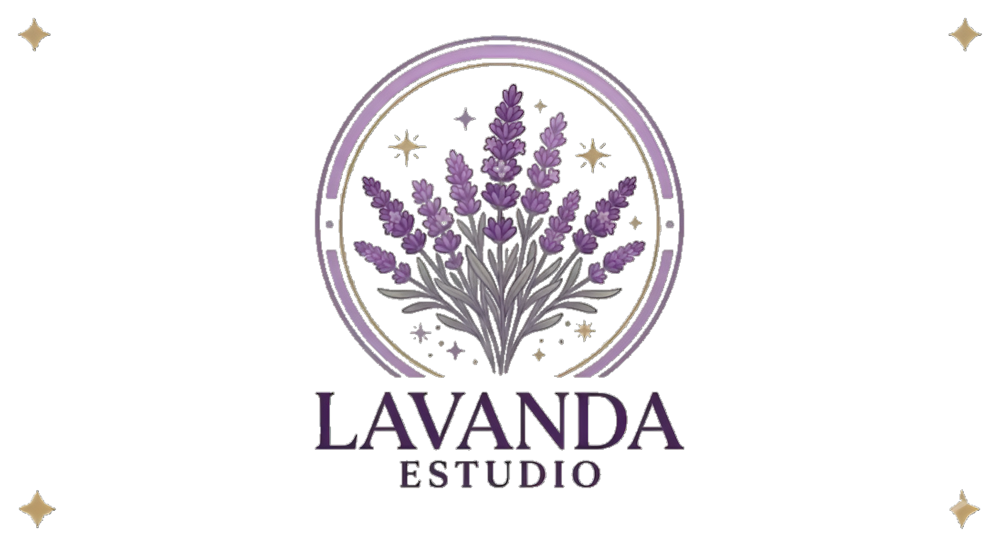

# 💜 Lavanda Estudio

> *Tu belleza, con el toque de Lavanda.*

Sitio web oficial de **Lavanda Estudio**, un espacio dedicado a la manicura y pedicura donde cada detalle importa. Diseñado con una estética elegante, femenina y moderna para reflejar la identidad de la marca.

---

## ✨ Vista previa



---

## 🌸 Secciones del sitio

| Sección | Descripción |
|---|---|
| **Inicio (Hero)** | Presentación principal con llamada a la acción |
| **Sobre Lavanda** | Historia y filosofía del estudio |
| **Servicios** | Manicura y Pedicura disponibles |
| **Próximamente** | Peluquería, Maquillaje, Depilación, Spa & Bienestar |
| **Galería** | Muestra de trabajos realizados |
| **Precios** | Tabla de precios por servicio |
| **Contacto** | Enlace directo a WhatsApp para reservar cita |

---

## 🛠️ Tecnologías utilizadas

- **HTML5** — Estructura semántica del sitio
- **CSS3** — Estilos personalizados con variables, animaciones y diseño responsive
- **JavaScript (Vanilla)** — Interactividad: menú hamburguesa, animaciones de scroll (Intersection Observer)
- **Google Fonts** — Tipografías *Cormorant Garamond* y *DM Sans*
- **Font Awesome 6** — Iconografía

---

## 🚀 Cómo usar

Este es un sitio web estático. No requiere instalación ni dependencias.

```bash
# Clona el repositorio
git clone https://github.com/Pdamg10/lavanda-estudio.git

# Abre el archivo en tu navegador
# Haz doble clic en index.html o usa Live Server en VS Code
```

---

## 📁 Estructura del proyecto

```
lavanda-estudio/
├── index.html          # Estructura principal del sitio
├── style.css           # Estilos globales y responsive
├── script.js           # Lógica de interactividad
├── assets/
│   ├── logo-lavanda-transparente.png
│   ├── favicon.svg
│   ├── about.jpg
│   └── gallery/
│       ├── foto-1.jpg
│       ├── foto-2.jpg
│       └── ...
└── README.md
```

---

## 📞 Contacto del negocio

- 📱 **WhatsApp:** [+58 426-9911560](https://wa.me/584269911560)
- 📸 **Instagram:** Próximamente
- 🎵 **TikTok:** Próximamente

---

## 📄 Licencia

© 2025 Lavanda Estudio · Todos los derechos reservados.
